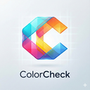

  

<h1 align="center">ColorCheck</h1>

  <strong>Eyedropper & Palette Extractor for Web Designers</strong>

  
  
  
  

---

## Overview

ColorCheck is a browser extension designed for web designers and developers. Pick colors from any webpage with a single click, or extract complete color palettes from image regions. Works entirely offline with no data collection.

---

## Features

### 🎯 Eyedropper Mode
Pick any color from the current webpage with pixel-perfect precision.
- Click anywhere to capture the exact color
- Instant copy to clipboard in your preferred format
- Live color preview with HEX value display

### 🎨 Palette Extraction
Drag to select any region and automatically extract a harmonious 4-color palette.

| Mode | Description |
|------|-------------|
| **Palette** | Extracts Primary, Base, Accent 1, Accent 2 – optimized for web design |
| **Accent** | Focuses on vibrant, visually distinct accent colors from the selection |

### ⚙️ Customization
- **Color Formats** — HEX, RGB, or HSL output
- **Favorites** — Save and export your color collections
- **History** — Quick access to recently picked colors
- **Light/Dark Mode** — Adapts to your preference

### ⌨️ Keyboard Shortcuts
| Action | Windows/Linux | macOS |
|--------|---------------|-------|
| Eyedropper | `Ctrl+Shift+E` | `⌘+Shift+E` |
| Palette | `Ctrl+Shift+P` | `⌘+Shift+P` |

> Shortcuts can be customized in your browser's extension settings.

---

## Installation

### Chrome Web Store
1. Visit the [Chrome Web Store](https://chrome.google.com/webstore) page for ColorCheck
2. Click **Add to Chrome**
3. Confirm by clicking **Add Extension**

### Opera Add-ons
1. Visit the [Opera Add-ons](https://addons.opera.com) page for ColorCheck
2. Click **Add to Opera**

### Manual Installation (Developer Mode)
1. Download or clone this repository
2. Open your browser's extension page:
   - **Chrome:** `chrome://extensions`
   - **Opera:** `opera://extensions`
3. Enable **Developer Mode** (toggle in top-right corner)
4. Click **Load unpacked**
5. Select the `ColorCheck` folder

---

## Usage

### Quick Start
1. Click the ColorCheck icon in your browser toolbar
2. Choose your mode:
   - **Pick Color** — Activates the eyedropper
   - **Extract Palette** — Enables region selection
3. Click or drag on the webpage to capture colors
4. Colors are automatically copied to your clipboard

### Working with Palettes
- Switch between **Palette** and **Accent** modes using the toggle
- Click any color swatch to copy its value
- Use the ★ button to save colors to your favorites
- Access all saved colors in the Settings page

### Exporting Colors
1. Open **Settings** via the gear icon
2. Navigate to the **Favorites** section
3. Click **Export** to download as a text file

---

## Privacy

ColorCheck operates entirely offline. No data is collected, stored externally, or transmitted. All color data remains local to your browser.

[View Privacy Policy](https://mello2110.github.io/colorcheck-privacy-policy/)

---

## Technical Specifications

| Requirement | Details |
|-------------|---------|
| Manifest | V3 |
| Permissions | `activeTab`, `scripting`, `storage` |
| Compatibility | Chrome, Opera, Edge (Chromium-based browsers) |
| Offline Support | Full functionality without internet |

---

## License

Licensed under the Apache License, Version 2.0. See [LICENSE](LICENSE) for details.

---

  Made by <strong>Mellow Solutions</strong>

